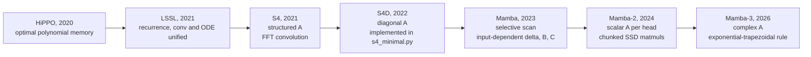
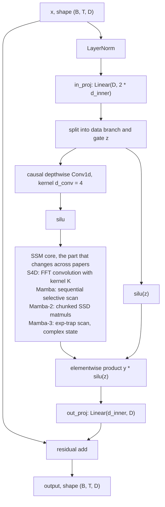
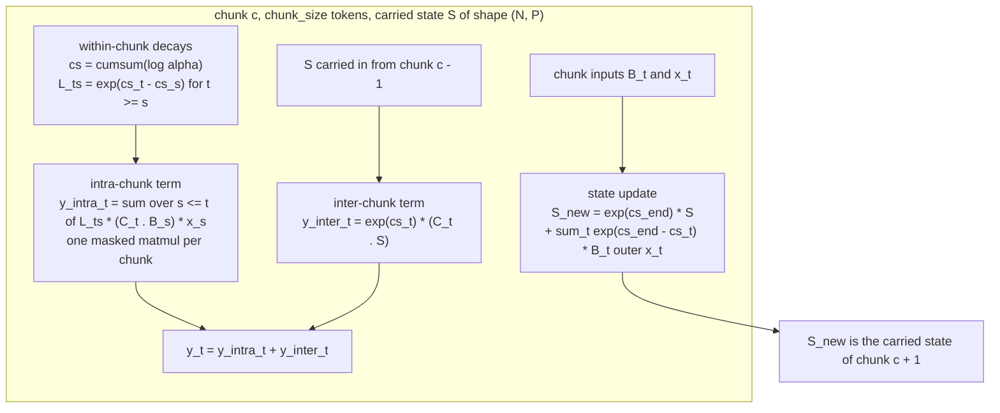

# From S4 to Mamba-3: how the state transition evolved

This repository (package `ssmbench`) implements five sequence model backbones from first
principles in pure PyTorch, each small enough to read top to bottom:

| File | Model | Role in this study |
|---|---|---|
| `src/ssmbench/models/transformer_minimal.py` | Causal Transformer | Quality and scaling baseline: pre-norm blocks, `F.scaled_dot_product_attention`, sinusoidal positions |
| `src/ssmbench/models/s4_minimal.py` | S4D | Diagonal restriction of S4: ZOH discretization, FFT-convolution training form, O(1)-state recurrent step form |
| `src/ssmbench/models/mamba_minimal.py` | Mamba-1 | Selective SSM: sequential scan training form plus a verified incremental `step()` decode |
| `src/ssmbench/models/mamba2_minimal.py` | Mamba-2 | Scalar-per-head transitions and the chunked SSD algorithm, verified against a sequential reference |
| `src/ssmbench/models/mamba3_minimal.py` | Mamba-3 | Complex-valued transitions with exponential-trapezoidal discretization |

All five share one skeleton: a linear first-order recurrence over a fixed-size state,

```
h_t = A_t h_{t-1} + B_t x_t,      y_t = C_t^T h_t
```

What changes across the papers is what `A_t` is allowed to be, how the continuous-time step is
converted to discrete time, and which equivalent computational form (convolution, scan, or
chunked matmul) runs on hardware. This document traces those choices in order. Every
mathematical claim made here is checked by an equivalence test in `tests/test_models.py`, and
every benchmark number cited is read from a committed JSON in `results/`.



## 1. S4 and S4D: the continuous-time template

### The model

S4 starts from a continuous-time linear state space:

```
h'(t) = A h(t) + B x(t),      y(t) = C^T h(t) + D x(t)
```

`A` encodes how past inputs decay and oscillate inside `h`. The HiPPO theory
(arXiv:2008.07669) supplies a specific structured `A` whose state holds the coefficients of an
orthogonal polynomial projection of the input history, which is a principled answer to "what
should a fixed-size memory contain". S4 initializes `A` from HiPPO and trains it.

Sequences are discrete, so the ODE is discretized with step size `delta`. Under zero-order
hold (the input is constant during one step):

```
Abar = exp(delta * A)
Bbar = A^{-1} (exp(delta * A) - I) B = delta * B * (e^z - 1)/z,   z = delta * A
```

The `(e^z - 1)/z` factor is the exact ZOH input integral, not an approximation. Our
`zoh_discretization` in `src/ssmbench/models/s4_minimal.py` computes it explicitly, with a
Taylor fallback near `z = 0` so the ratio stays finite as `delta * A` goes to zero.

After discretization there are two equivalent forms:

- Convolution form (training): the output is a causal convolution with the kernel
  `K_k = sum_n C_n Bbar_n Abar_n^k`, computed with FFTs in O(T log T).
- Recurrent form (inference): step the recurrence with a (D, N) complex state, O(1) per token.

`test_s4d_conv_equals_recurrent` in `tests/test_models.py` runs both paths on the same
`S4DLayer` and requires agreement to 1e-3. This test is the definition of "the two forms are
the same model"; if it failed, either the kernel derivation or the discretization would be
inconsistent with the recurrence.

### What we implement, plainly

We implement the **S4D diagonal restriction** (arXiv:2206.11893): `A` is complex diagonal, at
init `A_n = -1/2 + i * pi * n` (S4D-Lin; `S4D-Inv` is also available), with learnable real part
and imaginary part. Complex diagonal entries already allow rotation of the state, and the
S4D paper shows the diagonal case keeps essentially all of S4's quality at far less
complexity. The kernel uses the real part of the complex convolution.

Full S4 (the Normal-Plus-Low-Rank parameterization with the Woodbury-corrected Cauchy kernel)
is **referenced, not reimplemented**. It is the bridge from HiPPO to S4D, but its machinery
exists to handle a non-diagonal `A`; once `A` is diagonal the kernel collapses to a sum over
state channels, which is what `S4DLayer.kernel` computes directly, in chunks so the
`(chunk, D, N)` power tensor stays small.

## 2. Mamba: selectivity breaks the convolution form

Mamba (arXiv:2312.00752) makes the SSM a function of the content: `delta_t`, `B_t`, `C_t` are
projections of the current token, produced by `x_proj` and `dt_proj` in
`src/ssmbench/models/mamba_minimal.py`. The step size `delta_t` is the selectivity knob: after
`delta_t = softplus(dt_proj(...))` it is positive, and it sets the per-token timescale. Small
`delta_t` keeps the state almost unchanged (long memory); large `delta_t` overwrites the state
with the current token (forget and write).

This one change has two consequences that define everything after S4.

First, the convolution form dies. `K_k = C Bbar Abar^k` is a fixed kernel only because
`A, B, C, delta` are constants. Once they depend on the token, the system is time-varying: the
"kernel" that maps the input prefix to the output would itself depend on the entire input
sequence, so there is no fixed filter to convolve with. Training must run the scan. This is
the practical difference between an LTI system and a selective one, and it is why S4 has an
FFT path and Mamba does not.

Second, the discretization becomes exponential-Euler: the transition uses the exact
`alpha_t = exp(delta_t * A)` while the input uses the first-order `delta_t * B_t`. The Mamba-3
paper later formalizes exactly this rule in its Table 1. Our implementation follows the same
convention, including the log-uniform `dt` bias initialization in `[1e-3, 1e-1]` via the
inverse softplus, matching the official code (see REFERENCES.md for what was and was not
taken from it).

Note what `A` is at this point: a real negative diagonal. Therefore
`alpha_t = exp(delta_t * A)` lies in `(0, 1)` per entry: every transition only scales the
state down. Keep this in mind until Section 4.

The block around the scan is: `in_proj` to `2 * d_inner`, a causal depthwise convolution of
width `d_conv = 4`, `silu`, the selective scan, then a gate `y * silu(z)` and `out_proj`. The
short convolution restores cheap local token mixing that a state-only model lacks, and the
gate lets the network decide per channel how much of the SSM output passes. For inference,
`MambaBlock.step()` carries the state `h` of shape `(B, d_inner, N)` plus the last
`d_conv - 1` conv inputs, giving O(1) decode per token; `test_mamba_step_equals_forward`
verifies the step path reproduces the parallel forward path to 1e-3.



The scan itself is the honest weak spot of an educational implementation: the official Mamba
uses a fused parallel associative scan on GPU, ours is an explicit python loop over `T` steps.
The operation count is O(T), but the wall-clock is dominated by per-step overhead. That gap is
pedagogically the point (see Section 5), and it is also the practical motivation for Mamba-2.

## 3. Mamba-2: scalar transitions and State Space Duality

Mamba-2 (arXiv:2405.21060) restricts the transition to a scalar times the identity per head:
`A = a_h I` with learned `a_h < 0`. The decay becomes a scalar per head and per token,
`alpha_{h,t} = exp(delta_{h,t} * a_h)`, and the recurrence turns into a scalar-decayed linear
map. That restriction is what makes an algebraic unrolling possible: over a chunk of tokens,
the recurrence can be rewritten as a masked, decay-weighted quadratic form that looks like
attention. This is the State Space Duality (SSD): the same layer is both a recurrence (linear
in T, constant state) and an attention-like matmul (quadratic within a chunk, tensor-core
friendly).

In `src/ssmbench/models/mamba2_minimal.py`, per head `h` with head dimension `P` and state
size `N`, with `B` and `C` shared per group (`n_groups`):

```
within a chunk of length chunk_size, with cs = cumsum(log alpha) inside the chunk:

L_ts       = exp(cs_t - cs_s)  for t >= s        (decayed lower-triangular mask)
y_intra_t  = sum_{s <= t} L_ts * (C_t . B_s) * x_s      (attention-like matmul)
y_inter_t  = exp(cs_t) * (C_t . S)                      (carry-in from previous chunks)
S_new      = exp(cs_end) * S + sum_t exp(cs_end - cs_t) * B_t (outer) x_t
```

`y_t = y_intra_t + y_inter_t`. The only thing that crosses a chunk boundary is the `(N, P)`
state `S`. The chunk loop runs `T / chunk_size` iterations instead of `T`, and each iteration
is small matmuls. This is why Mamba-2 exists: tensor cores execute matmuls efficiently, not
long dependent chains of scalar operations, and the chunked form converts the scan into
matmul-shaped work.

Implementation notes that matter numerically: the decay matrix is built in log space
(`cumsum` of `log alpha`, clamped before exponentiation) so that upper-triangular differences
cannot overflow fp32 `exp`, and sequences whose length is not a multiple of `chunk_size` are
padded. `Bx = delta_t * B_t` is precomputed as the state input, matching the exponential-Euler
input term.

Correctness is not asserted, it is tested:
`tests/test_models.py::test_mamba2_chunked_equals_sequential` runs `chunked_scan` and
`sequential_scan` on identical inputs for `chunk_size = 32` and `chunk_size = 64` (the latter
pads a misaligned length) and requires agreement to 1e-3. A failure there would mean the
algebraic unrolling is wrong, not that a kernel is slightly off; the chunked form is a
rearrangement of the same sum, so it must match to floating-point tolerance.



## 4. Mamba-3: complex transitions and the exponential-trapezoidal rule

Mamba-3 (arXiv:2603.15569) changes three things relative to Mamba-2. Our
`src/ssmbench/models/mamba3_minimal.py` implements the first two exactly and describes the
third.

### 4.1 Exponential-trapezoidal discretization

Mamba-1/2 inject the input at the right endpoint of each interval only (exponential-Euler).
Mamba-3 approximates the state-input integral with a data-dependent convex combination of
both endpoints:

```
h_t    = alpha_t h_{t-1} + beta_t B_{t-1} x_{t-1} + gamma_t B_t x_t
alpha_t = exp(delta_t * A_t)
beta_t  = (1 - lambda_t) * delta_t * alpha_t
gamma_t = lambda_t * delta_t
```

`lambda_t in (0, 1)` is predicted per token by a sigmoid gate (`lambda_proj`, zero-initialized
so training starts at the balanced `lambda = 1/2`). Setting `lambda = 1` recovers Mamba-1/2
exactly; `lambda = 1/2` is the classical trapezoidal rule; `lambda = 0` is the pure left
endpoint. The rule is second-order accurate in `delta` because the integrand `B(t) x(t)` is
sampled at both endpoints and the leading error term cancels. Note that `beta_t` carries the
factor `alpha_t`: the left-endpoint input must be decayed across the interval it is held over.

This is implemented exactly in `selective_scan`, with `prev_inject` carrying
`B_{t-1} x_{t-1}` between loop iterations. `test_mamba3_reduces_to_exp_euler` pins
`lambda = 1` and `theta = 0` (real transition) and requires the update to equal a hand-written
Mamba-1/2 exponential-Euler reference to 1e-3: the new rule must contain the old one as a
special case, and if it does not, the weights `beta` and `gamma` are wrong.

### 4.2 Complex-valued transitions

The diagonal `A` becomes complex: `A = -exp(a_real) + i * theta` per (head, state), with
`theta` initialized to `pi * n` (S4D-Lin-style rotation frequencies). Two properties hold at
once:

- Stability: `|alpha_t| = exp(delta_t * Re(A)) < 1`, guaranteed by the negative real part.
  `test_mamba3_alpha_is_contractive_with_rotation` asserts this.
- Rotation: the phase `delta_t * theta` rotates the state in the complex plane.

The second property is the expressive one. A real non-negative transition can only decay or
grow the state; it cannot rotate. State-tracking problems whose answer depends on the order
and parity of events, of which cumulative XOR is the smallest example, require rotation-like
transitions. The Mamba-3 paper's discussion of expressivity (drawing on results of Grazzi et
al. on state tracking in recurrent models and Merrill et al. on the limits of real-valued
transitions) makes this argument formally; our parity benchmark reproduces it empirically.

On cumulative XOR (L = 128, 20 epochs, `results/parity_*.json`):

| Model | Token accuracy | Sequence success |
|---|---|---|
| mamba3 | 0.9834 | 0.42 |
| mamba2 | 0.563 | 0.0 |
| mamba | 0.559 | 0.0 |
| transformer | 0.533 | 0.0 |
| s4d | 0.506 | 0.0 |

All four real-transition baselines sit at or barely above the 0.5 token-level chance rate and
solve zero full sequences. Mamba-3, the only model here whose transitions can rotate, reaches
0.9834 token accuracy and solves 42 percent of sequences fully. This reproduces the Mamba-3
paper's motivating claim with a from-scratch implementation.

S4D deserves its own sentence here: it also has complex `A`, and it still fails parity
(0.506, sequence success 0.0). Complexity of the transition is not sufficient; the transition
must also be input-dependent. S4D is LTI: `A, B, C, delta` are constants, the rotation is
fixed at initialization and training time, and the input only drives a fixed linear system
additively. Parity requires multiplying the state by a factor that depends on the current
bit, which no fixed linear system can do. Selectivity (Mamba) plus rotation (Mamba-3) is what
the task demands.

### 4.3 MIMO formulation (described, not implemented)

The paper reformulates the layer so multiple input and output channels share each state slot
(MIMO instead of SISO per head), improving quality without increasing decode latency. Our
implementation keeps the SISO-per-head structure of Mamba-2's SSD and does not implement the
MIMO dual form; the module docstring in `mamba3_minimal.py` says the same. The paper's
parallel dual, a 1-semiseparable matrix composed with a 2-band matrix (a generalization of
Mamba-2's SSD), is also not implemented: we run the sequential recurrent form only.

### Comparison at a glance

| Model | Transition A | Discretization | Training form | Inference state | Capability notes |
|---|---|---|---|---|---|
| Transformer (`transformer_minimal.py`) | n/a, softmax attention weights | n/a | Attention over all pairs, O(T^2) score compute | KV cache, grows linearly with T | Strong baseline; needs positional encodings; no fixed-size state |
| S4 (referenced, not reimplemented) | Dense structured (NPLR), HiPPO init | ZOH | FFT convolution with Woodbury-corrected kernel | O(DN) recurrent state | Long-range memory via HiPPO spectrum |
| S4D (`s4_minimal.py`) | Complex diagonal, S4D-Lin init `A_n = -1/2 + i pi n` | ZOH with exact `(e^z - 1)/z` factor | FFT convolution, O(T log T) | Complex `(B, D, N)`, O(1) per token | LTI: one fixed kernel; rotates but cannot re-time or filter per token |
| Mamba-1 (`mamba_minimal.py`) | Real negative diagonal `(d_inner, N)` | Exponential-Euler: `exp(delta A)` transition, `delta B` input | Sequential selective scan (python loop here) | `(B, d_inner, N)` plus conv history, O(1) per token | Selective: delta, B, C depend on the token; decay-only transitions |
| Mamba-2 (`mamba2_minimal.py`) | Scalar per head times identity, `a_h < 0` | Exponential-Euler per head | Chunked SSD matmuls (sequential reference also provided) | `(N, P)` per head, O(1) per token | SSD duality; tensor-core friendly; decay-only transitions |
| Mamba-3 (`mamba3_minimal.py`) | Complex diagonal per (head, state), `-exp(a) + i theta` | Exponential-trapezoidal: `beta_t = (1 - lambda_t) delta_t alpha_t`, `gamma_t = lambda_t delta_t` | Sequential scan (paper's parallel dual not implemented) | Complex `(N, P)` per head, O(1) per token | Selective plus rotation: state tracking; second-order accurate rule |

## 5. What we did and did not implement

### Implemented

- Five backbones from first principles in pure PyTorch, readable end to end, no compiled
  extensions.
- Both computational forms wherever they exist, with equivalence tests at 1e-3 in
  `tests/test_models.py`: FFT convolution versus recurrent steps for S4D
  (`test_s4d_conv_equals_recurrent`), chunked versus sequential SSD for Mamba-2
  (`test_mamba2_chunked_equals_sequential`, including a padded misaligned length), and
  parallel forward versus incremental step for Mamba-1 (`test_mamba_step_equals_forward`).
- A verified reduction test tying Mamba-3 back to Mamba-1/2
  (`test_mamba3_reduces_to_exp_euler`) and a stability-plus-rotation property test
  (`test_mamba3_alpha_is_contractive_with_rotation`).
- O(1)-state incremental decode paths for S4D (`S4DBlock.init_state` / `step`) and Mamba-1
  (`MambaBlock.init_state` / `step`), carrying the exact recurrence state and the short-conv
  history.
- Benchmarks with committed JSON results: parity, selective copying, IMDb sentiment, and a
  length-efficiency sweep, driven by `scripts/run_training.py` and `scripts/run_efficiency.py`
  with configs in `configs/`.

### Not implemented

- Fused kernels. The official Mamba selective-scan CUDA kernel and the official Mamba-2
  Triton chunk kernels are not used or reimplemented. All our scans are python loops over
  time (Mamba-1, Mamba-3) or loops over chunks (Mamba-2).
- Full S4. The NPLR parameterization and the Woodbury-corrected Cauchy kernel are referenced,
  not reimplemented; only the S4D diagonal restriction exists here.
- Mamba-3 parallel dual and MIMO. We implement the sequential SISO recurrence exactly; the
  paper's 1-semiseparable-times-2-band dual and the MIMO formulation are described only.
- Parallel (associative) scan for Mamba-1 and the hardware-aware per-sequence `dt` scaling
  from the Mamba paper.
- Incremental `step()` decode for Mamba-2 and Mamba-3. Their per-token state is conceptually
  the `(N, P)` matrix per head, but no tested decode path is implemented in this repository.

### The cost of honesty

Our sequential loops are O(T) in operations but slow in wall-clock: in eager-mode PyTorch,
every python-loop iteration launches small kernels and the launch overhead dominates. The
measured gap is visible in the `wall_time_seconds` field of every JSON in `results/` (the
python-loop Mamba and Mamba-3 runs take an order of magnitude longer per epoch than the
chunked Mamba-2 runs on the same tasks) and in the length sweep of
`results/efficiency_gpu.json` produced by `scripts/run_efficiency.py`. This is pedagogically
the point: it makes the difference between asymptotic operation counts and wall-clock time
tangible, and it is exactly why fused selective-scan kernels and the chunked SSD formulation
exist.

### Reproducing the numbers

```
python scripts/run_training.py --config configs/parity.yaml --out results/
python scripts/run_training.py --config configs/selective_copy.yaml --out results/
python scripts/run_training.py --config configs/imdb.yaml --out results/
python scripts/run_efficiency.py --config configs/efficiency.yaml
```

Each run writes one JSON per model with its full data, train, and model config, the epoch
history, parameter count, peak GPU memory, and wall time. At the time of writing, the IMDb
runs for the mamba family are still in flight; see `results/imdb_*.json` for whatever has
landed, and treat nothing as claimed that is not in a committed JSON.
